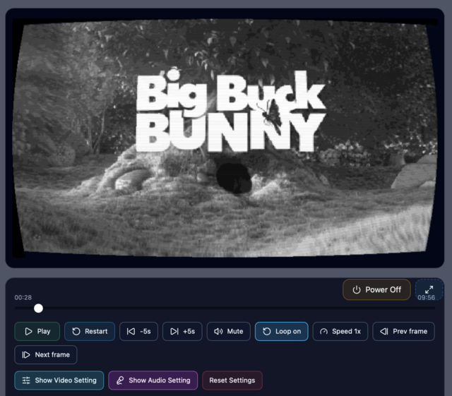
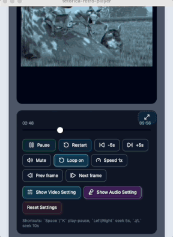

# Tetorica Retro Player

Retro-style preview player for images, videos, and live screen capture.

The app uses a Pixi.js shader pipeline to push local media through palette reduction, monochrome tints, dithering, scanlines, and CRT-style finishing. The same filter flow works for still images, movie files, and captured windows or screens.



https://kyorohiro.itch.io/tetorica-retro-player

## Demo

- GitHub Pages landing page:
  [https://kyorohiro.github.io/tetorica-retro-player/](https://kyorohiro.github.io/tetorica-retro-player/)

- Demo app:
  [https://kyorohiro.github.io/tetorica-retro-player/demo/](https://kyorohiro.github.io/tetorica-retro-player/demo/)





## Features

- Drag and drop image or video files for instant preview
- Capture a window or screen and run it through the same retro filter
- Switch between retro presets and fine-tune target size, color count, dithering, and CRT effects
- Try monochrome tint modes such as gray, green, amber, and ice
- Use playback controls for video, including seek, loop, volume, playback speed, and keyboard shortcuts
- Maximize the preview in-page without duplicating the rendering pipeline

## Tech Stack

- React
- TypeScript
- Vite
- Pixi.js
- Tauri

## Local Development

```bash
npm install
npm run dev
```

## Build

```bash
npm run build
```

The web build is emitted to `dist/`.

## GitHub Pages

This repository is set up so that:

- `docs/index.html` works as the landing page
- `docs/demo/` contains the built demo app

When updating the public demo, rebuild the app and copy the latest build output into `docs/demo/`.

## Notes

- Screen capture availability depends on browser support and permission prompts.
- The GitHub Pages demo is best experienced on a desktop Chromium-based browser.

## License

This project is licensed under the MIT License.

Third-party libraries and bundled dependencies remain under their respective licenses.


## Release Memo

```
sh deploy_mac.sh
% ~/bin/butler login
% ~/bin/butler push src-tauri/target/aarch64-apple-darwin/release/bundle/dmg/tetorica-retro-player_0.6.4_aarch64.dmg kyorohiro/tetorica-retro-player:mac-apple-silicon --userversion 0.6.4

% ~/bin/butler push src-tauri/target/x86_64-apple-darwin/release/bundle/dmg/tetorica-retro-player_0.6.4_x64.dmg kyorohiro/tetorica-retro-player:mac-intel --userversion 0.6.4

% ~/bin/butler push "tetorica-retro-player_0.6.4_x64-setup.exe" kyorohiro/tetorica-retro-player:windows --userversion 0.6.4

% ~/bin/butler push "tetorica-retro-player_0.6.4_aarch64.AppImage" kyorohiro/tetorica-retro-player:linux-arm --userversion 0.6.4
% ~/bin/butler push "tetorica-retro-player_0.6.4_amd64.AppImage" kyorohiro/tetorica-retro-player:linux-intel --userversion 0.6.4

```

```
npm run build
cd dist
zip -r ../web-build_0.6.4_gh.zip .
```
