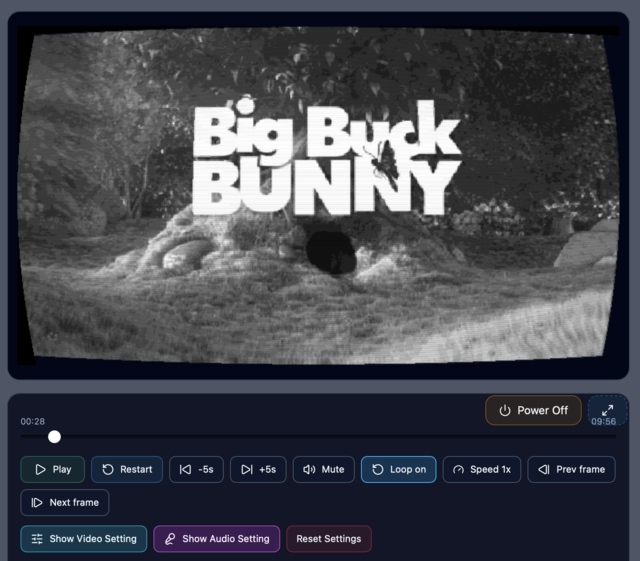
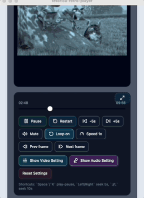

# Tetorica Retro Player

Retro-style preview player for images, videos, and live screen capture.

The app uses a Pixi.js shader pipeline to push local media through palette reduction, monochrome tints, dithering, scanlines, and CRT-style finishing. The same filter flow works for still images, movie files, and captured windows or screens.



https://kyorohiro.itch.io/tetorica-retro-player

## Demo

- GitHub Pages landing page:
  [https://kyorohiro.github.io/tetorica-retro-player/](https://kyorohiro.github.io/tetorica-retro-player/)

- Demo app:
  [https://kyorohiro.github.io/tetorica-retro-player/demo/](https://kyorohiro.github.io/tetorica-retro-player/demo/)




## Chrome Plugin

- [https://chromewebstore.google.com/detail/tetorica-retro-player/clnpmlgahomdkphcpcajbemodneoecna](https://chromewebstore.google.com/detail/tetorica-retro-player/clnpmlgahomdkphcpcajbemodneoecna)


## Features

- Drag and drop image or video files for instant preview
- Capture a window or screen and run it through the same retro filter
- Switch between retro presets and fine-tune target size, color count, dithering, and CRT effects
- Try monochrome tint modes such as gray, green, amber, and ice
- Use playback controls for video, including seek, loop, volume, playback speed, and keyboard shortcuts
- Maximize the preview in-page without duplicating the rendering pipeline

## MSX1 / SCREEN 2

In the Classic presets, choose **MSX1 / SCREEN 2 → Nearest** or **Error diffusion**.
**Extended 32** is the default preset, with Error diffusion set to **0.12**.
It sits beside Error diffusion and adds dark tones, browns and skin
tones for 32 distinct opaque colors. It retains 256×192, two colors per 8×1 block
and vertical diffusion, but uses an expanded palette rather than the MSX1 hardware palette.
The conversion runs in a dedicated Pass 1 at a fixed 256×192, before the existing
CRT, scanline and display effects. Each aligned 8×1 block selects a pair from the
fixed TMS9918A RGB palette approximation and encodes an 8-bit 1bpp pattern.
Nearest minimizes RGB reconstruction error across the block; diffusion also
scores color mixtures, then carries quantization error vertically along the selected
pair’s color axis. The Error diffusion slider ranges from 0 (nearest) to 1 (full
vertical diffusion). Each scanline selects pairs independently, allowing
horizontal bands without an added stripe overlay.

Color 0 (transparent) resolves to a black backdrop. This approximates the
Graphic II background restrictions described in the [TI TMS9918A data manual](https://www.bitsavers.org/components/ti/TMS9900/TMS9918A_TMS9928A_TMS9929A_Video_Display_Processors_Data_Manual_Nov82.pdf);
it does not emulate sprites, VRAM table sharing, or analog video timing.
Diffusion replays up to eight source rows using the current row’s color pair and
resets every eight rows. This is a local approximation rather than full-frame
error diffusion; preceding rows may select different pairs. Flat tones alternate
by scanline, producing horizontal bands instead of repeated vertical columns.
CRT effects can change the displayed RGB values after quantization.

## Tech Stack

- React
- TypeScript
- Vite
- Pixi.js
- Tauri

## Reusable Core

The reusable player core lives under `src/retro-player/`.

- `src/retro-player/components/RetroPlayer.tsx`: ready-to-embed retro preview player
- `src/retro-player/audio/TetoricaRetroAudioNode.ts`: reusable retro audio effect chain with a plain TypeScript API
- `src/retro-player/video/TetoricaRetroVideoPipeline.ts`: reusable WebGL2 video shader pipeline 
- `src/retro-player/retro/filterShader.ts`: shader source of truth


## Local Development

```bash
npm install
npm run dev
```

## Chrome Extension PoC

`extension/` contains a minimal Manifest V3 proof of concept for:

- clicking the Chrome action button
- capturing the current tab with `chrome.tabCapture`
- feeding the resulting `MediaStream` into a hidden `<video>`
- uploading that video into a WebGL texture
- converting it to grayscale in a fragment shader
- drawing the result into a `<canvas>`

To try it:

1. Open `chrome://extensions`
2. Enable Developer mode
3. Choose Load unpacked
4. Select this repository's `extension/` directory
5. Open a tab you want to capture
6. Click the extension button
7. In the popup, press `Capture current tab`

The PoC opens `viewer.html` in an extension tab and renders the captured tab through the shared retro shader while audio settings are controlled from the extension popup. It is intentionally small and separate from the main app so the capture path can be verified before porting more of the player UI.

To create a release ZIP for the Chrome Web Store upload flow:

```bash
npm run build:extension
```

The packaged archive is written to `release/`.

## Build

```bash
npm run build
```

The web build is emitted to `dist/`.


## Acknowledgments

The Beam presets were inspired by [@komm64's post on X](https://x.com/komm64/status/2073558529097834584).

The MSX presets were inspired by [@mdpc___'s post on X](https://x.com/mdpc___/status/2106170546560086264?s=20).

## License

This project is licensed under the MIT License.

Third-party libraries and bundled dependencies remain under their respective licenses.
